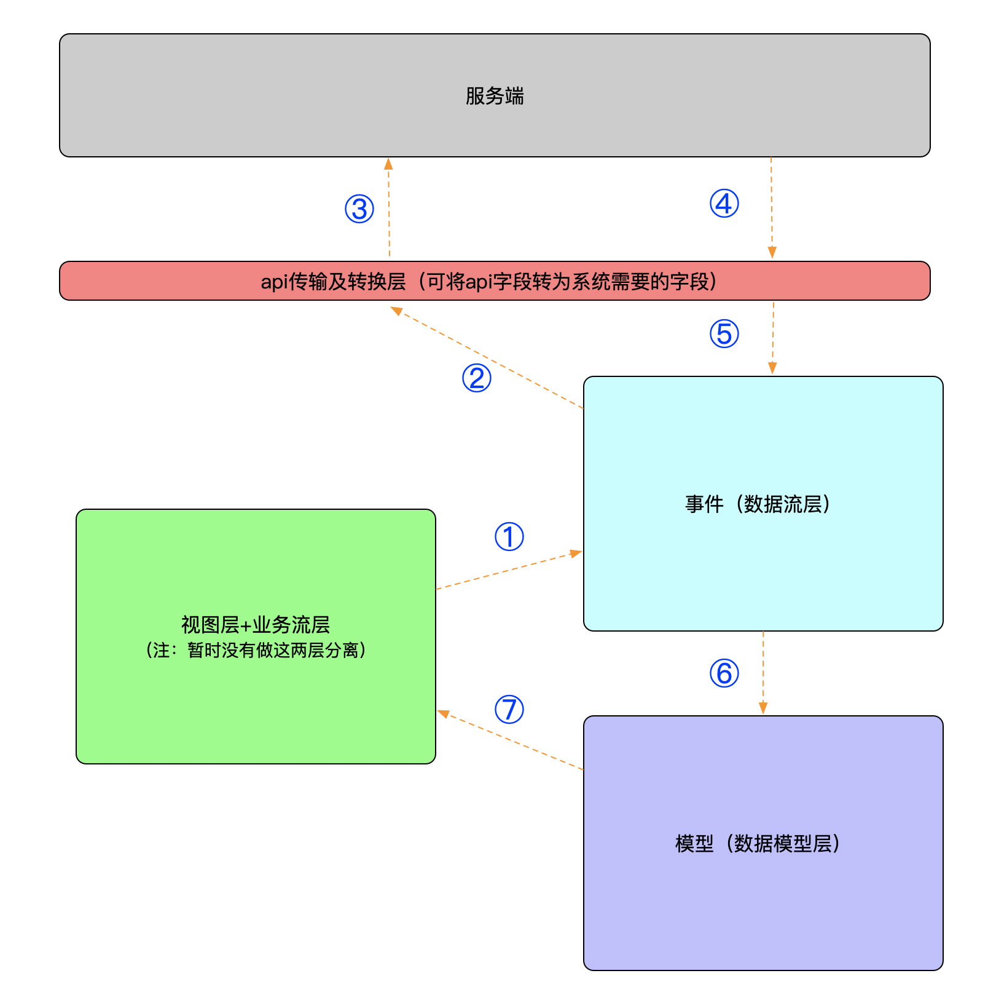

## 客户关系系统（ Customer Relationship System ）


---

#### 前言

> 基于多年的开发经验，为了提高自身开发效率，且方便刚打开源爱好者解决问题，故此编写了改前端框架，目的是为了保证后台的快速迭代开发，希望对广大开源爱好者有所帮助。


#### 框架特点

    * API使用
        - 支持多服务端访问，可以动态配置访问域名
        - 支持多种传输路径（如http、websock等，因为api采用命令式设计，故此只需要稍加改动即可双引擎共同支持）
        - 支持配置管理，通过API配置，动态生成后端访问
        - 支持Mock数据模拟，可以遵循软件开发规范，先定义接口，通过Mock返回服务端数据，从而不影响前端开发.
    * 框架特点
        - 视图层、数据模型层、数据流层、api传输层解耦分离
        - 可扩展性较好，如果运用得当，可以摆脱传统前端迎合后台接口的开发方式，促进控制反转状态，令后台返回的数据转换成前端生态所需要的数据，从而降低开发量.
        - 业务抽象适合80%的企业信息化场景，拿来可以直接进行使用，届时只需要匹配接口及字段即可。
    * 注意(缺点)
        - 为了保证编程的结构、规范，现在编写有些麻烦，有些冗余
        - 当下还有些未完善的部分，如：公共css、js库生产环境搭建、生产及开发编译分离，按需加载等
        - 数据配置中心现在还没有更好的抽象，如果能够编写组件构建引擎，再配合数据配置中心，将会极大的提高效率
        - 现在提供的模型字段在增加、删除方面不是很好，如果需要添加字段，则要修改视图层、数据流层、数据模型层、api层，成本有些高
        - Typescript熟练度不强，代码编写不是很漂亮，有部分代码因为懒，没有编写，引用网上资源，等有时间优化

#### 使用方式

```
# 安装依赖
npm install
# 开发启动 : 默认3000端口
npm start
```

#### 框架原理
<div style="text-align:center;width:25%;height:25%;">
    
</div>


#### 代码结构
```
.
├── build                                                                  // webpack 构建目录
├── dist                                                                   // 生产环境生成目录 
├── doc                                                                    // 框架文档目录
├── src                                                                    // 源码 
│   ├── assets                                                             // 资源包 
│   │   ├── image                                                          // 图片资源 
│   │   └── style                                                          // 样式资源
│   ├── common                                                             // 公共基础包 
│   │   ├── api                                                            // Api通信包
│   │   │   ├── core                                                       // Api通信核心包 
│   │   │   ├── fieldSet                                                   // Api字段容器
│   │   │   ├── fields                                                     // Api字段集
│   │   │   ├── register                                                   // Api注册器
│   │   │   ├── server                                                     // Api服务注册器 
│   │   │   └── tools                                                      // Api工具包 
│   │   ├── constants                                                      // 常量集 
│   │   ├── interface                                                      // 接口定义 
│   │   └── utils                                                          // 工具集 
│   │       ├── channel                                                    // 传输通道包 
│   │       ├── log                                                        // 系统日志包 
│   │       ├── permission                                                 // 权限工具 
│   │       ├── persistence                                                // 持久化工具 
│   │       ├── security                                                   // 安全工具 
│   │       └── tools                                                      // 其他工具 
│   ├── containers                                                         // 页面容器层（V - view） 
│   │   ├── app                                                            // app系统组件 
│   │   │   ├── components                                                 // app系统自定义全局组件 
│   │   │   └── layout                                                     // app框架布局组件，包含上、左、下、中等 
│   │   ├── base                                                           // app业务框架基础使用页面 
│   │   │   ├── centre                                                     // 个人中心页面 ,各个项目几乎不变
│   │   │   ├── login                                                      // 登录页面 ,各个项目几乎不变
│   │   │   └── permission                                                 // 权限页面 ,各个项目几乎不变
│   │   ├── components                                                     // app业务组件 
│   │   │   ├── account                                                    // 账户模块业务组件 
│   │   │   ├── authorization                                              // 权限-授权模块业务组件 
│   │   │   ├── permission                                                 // 权限-权限模块业务组件 
│   │   │   ├── person                                                     // 个人中心业务组件 
│   │   │   └── staff                                                      // 员工列表（花名册）业务组件 
│   │   ├── pages                                                          // 个性化业务组件 - 基于不同的业务，定制化开发 
│   │   └── tools                                                          // app页面容器工具集 
│   │       └── wrapper                                                    // app页面容器装饰器 (暂时没有使用)
│   ├── reduxes                                                            // app数据流层 (P + M : process <-> model)
│   │   ├── component                                                      // app模块组件
│   │   │   ├── app                                                        // app框架数据模型+事件组件 
│   │   │   ├── authorization                                              // 授权数据模型+事件组件 
│   │   │   ├── enterprise                                                 // 企业数据模型+事件组件 
│   │   │   ├── file                                                       // 文件数据模型+事件组件 
│   │   │   ├── permission                                                 // 权限数据模型+事件组件 
│   │   │   ├── person                                                     // 个人中心数据模型+事件组件 
│   │   │   └── staff                                                      // 员工数据模型+事件组件 
│   │   ├── middleware                                                     // redux中间件 
│   │   └── tools                                                          // app数据流层工具集 
│   │       ├── container                                                  // app数据流事件包装器 
│   │       └── model                                                      // app数据流数据基础模型工具 
│   ├── routes                                                             // app框架路由 
│   │   └── paths                                                          // 路由路径 
│   │       ├── permission                                                 // 权限路由 
│   │       └── person                                                     // 个人中心路由 
│   └── schema                                                             // 数据配置中心 
│       ├── api                                                            // api数据配置中心 
│       │   ├── enterprise                                                 // 企业api数据配置中心 
│       │   ├── file                                                       // 文件操作数据配置中心 
│       │   └── user                                                       // 用户api配置中心 
│       ├── menu                                                           // 框架菜单项配置中心 
│       │   ├── header                                                     // 头部菜单项配置 
│       │   └── sidebar                                                    // 左侧栏菜单配置 
│       └── server                                                         // 远程服务器配置 
└── types                                                                  // 全局生命类型（typescript使用） 
```
